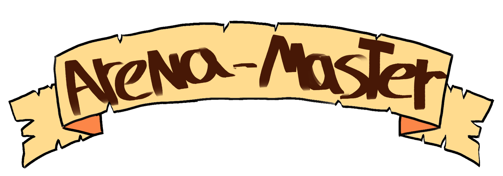

# ARENA-MASTER

## [Play the Game!](https://alejandrorodriguezojeda.github.io/Arena-master/)

# Description

Arena-master is a simple game where you must dodge and survive till the end, collecting coins all 
throughout so you can probably retire from dodging arrows all day long.

# Main Functionalities

- Full control of the player using by using the keyboard arrows
- Slow increase of difficulty as time passes
- Coin collection that shows as a highest score at the end
- Unforgiving hitboxes and collisions
- Somewhat randomized arrow patterns and coin patterns
- Enemy movement from side to side 
- a locally tracked high score system

# Backlog Functionalities

- A life counter because at this current state just one life is a bit unforgiving on your movement
- Improve the hitboxes a bit more
- show the high score system while in game instead of showing it at the victory screen
- possibly add more levels with all varying difficulties

# Technologies used

- HTML
- CSS
- JavaScript
- DOM Manipulation
- JS classes
- local storage
- JS Audio ()
- JS image ()

# States

- Start-Screen
- Game-Screen
- Gameover-Screen

# Extra Links 

### Slides
[Link](https://www.canva.com/design/DAFp6EC6Ehw/hefFhkTj1T4yy8dr3-qYsw/view?utm_content=DAFp6EC6Ehw&utm_campaign=designshare&utm_medium=link&utm_source=publishsharelink)

## Deploy
[Link](https://alejandrorodriguezojeda.github.io/Arena-master/)